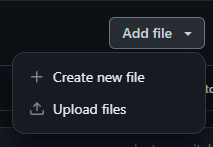
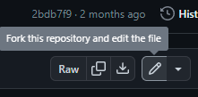
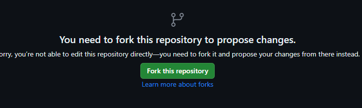
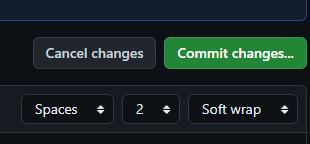
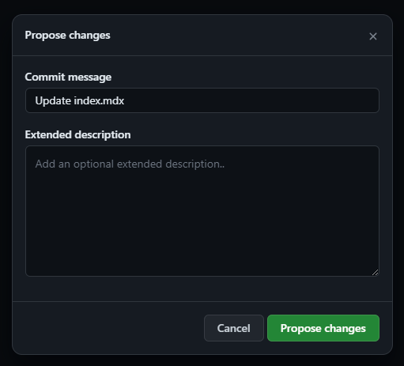
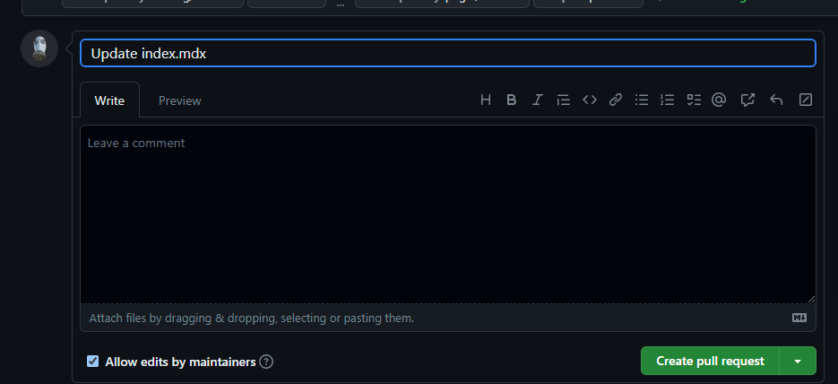

import { Steps } from 'nextra-theme-docs'

# How to Add or Modify Information

To edit the documentation, create an Issue or Pull Request on the [GitHub](https://github.com/psiget/s2ue-docs) page.

## Creating a Pull Request

<Steps>

### Choose or create the necessary file for editing

#### Creating or uploading a file

Select the appropriate option

---

#### Editing a file

Select the file and click on the "pencil" icon

### Create a Fork

### Make the necessary changes and click on `Commit changes`

### Click on `Propose changes`

### Click on `Create pull request`

### Click again on `Create pull request`

### Done! Just wait now

</Steps>

Thank you for your contribution! As soon as our moderators become available, they will proceed with reviewing your changes!
