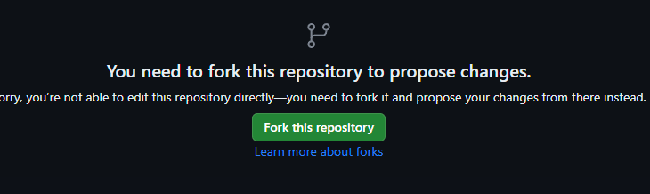
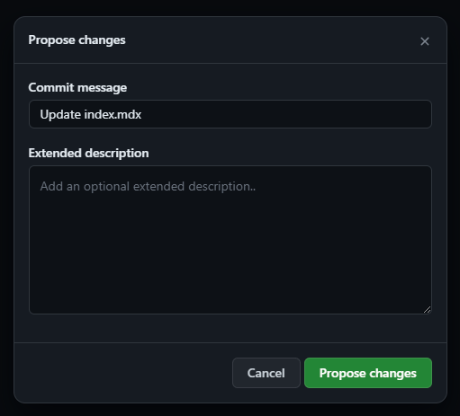

import { Steps } from 'nextra-theme-docs'

# Як додати або змінити інформацію

Щоб відредагувати документацію, створіть Issue або Pull Request на сторінці [GitHub](https://github.com/psiget/s2ue-docs).

## Створення Pull Request

<Steps>

### Виберіть потрібний файл для редагування

### Натисніть на іконку редагування

### Створіть Fork

### Внесіть необхідні зміни та натисніть `Commit changes`

### Натисніть `Propose changes`

### Натисніть `Create pull request`

### Натисніть знову `Create pull request`

### Готово! Залишилося лише зачекати!

</Steps>

Дякуємо за ваш внесок! Як тільки наші модератори матимуть вільний час, вони почнуть обробляти ваші зміни!
