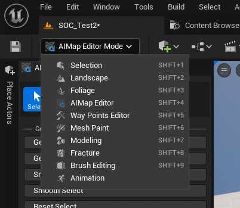
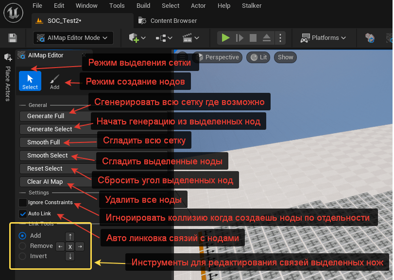
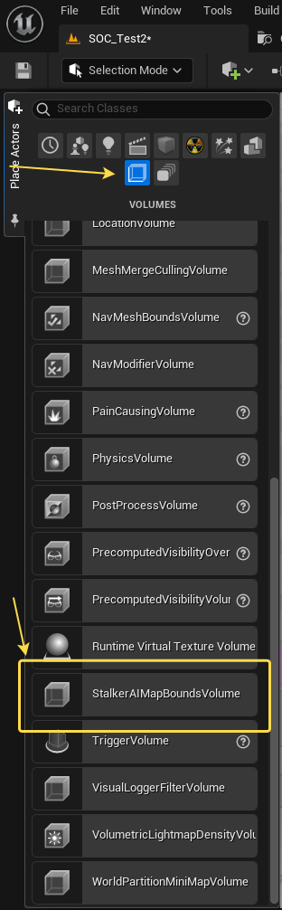
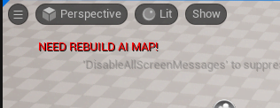
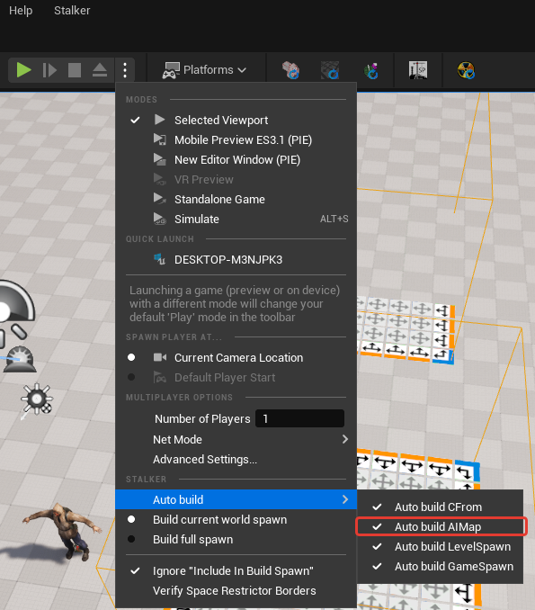
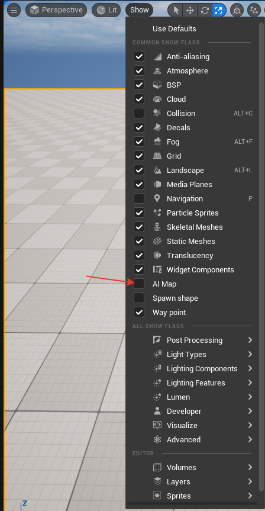

# Как работать с AI Map

## Создание AI Map
Создание и редактирование AI Map схоже с оригинальным редактором GSC. Для начало необходимо выбрать режим редактирования AI Map в редакторе.

### Описание окна редактора AI Map

### Примечания

- Генерация работает только в зоне StalkerAIMapBoundsVolume

* Генерация не будет работать за зоной StalkerAIMapBoundsVolume. Также их может быть несколько.

## Примеры работы с AI Map

### Генерация AI Map
import { Youtube } from 'components/youtube'

<Youtube code="aqi7WYrc2XE" />

## Дополнительная информация

UnrealEditor автоматически помечает, что AI стека требует пересборку

Сборка может быть автоматический при необходимости перед запуском PIE (Play In Editor)

Рендер AI Map можно включить и без режима редактирования AI Map в меню `show`

