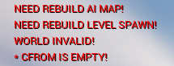
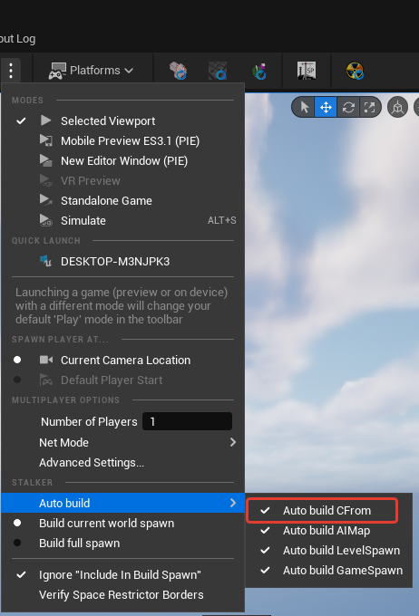

import { Callout } from 'nextra-theme-docs'

# Notes on CForm

CForm is geometry used for collision and physics in GSC.

<Callout type="info" emoji="ℹ️">
  Unlike [AI Map](./ai-map) or [Spawn Objects](./spawn-objects), it does not need to be checked for rebuild.
</Callout>

---

It can be set up to rebuild automatically before starting PIE (Play In Editor).

Alternatively, it can be manually rebuilt.

