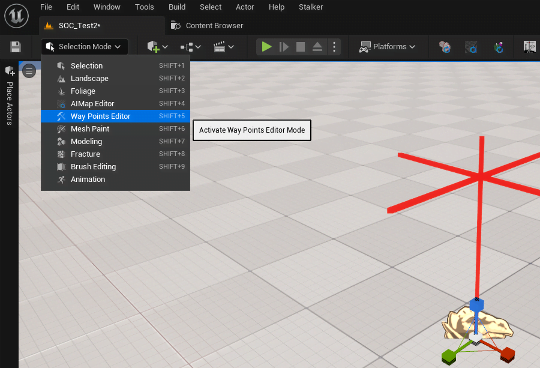

# How to Work with Way Objects

## Way Objects
To begin, you need to create a Way Object. Look for the Stalker Way Object in the `Place Actors` section.

Next, switch to the `Way Points Editor` editing mode.

### Description of Editing Mode
It is fully analogous to the original editor.

#### Example of Work
import { Youtube } from 'components/youtube'

<Youtube code="uCJ2ObdGlq4" />

## Additional Information

Way Objects are part of the spawn, so editing them renders the spawn outdated and requires rebuilding.
The rebuilding process can be automatic or manual, depending on your settings.
For information on how to work with spawn objects, please read [How to Work with Spawn Objects](./spawn-objects)

You can enable or disable the rendering of Way points in the `show` menu.

