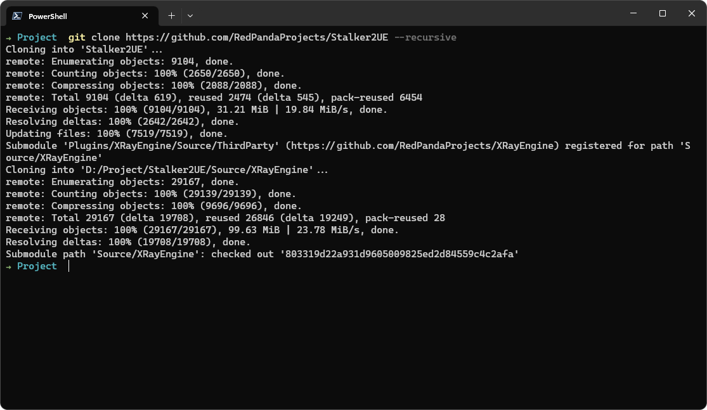
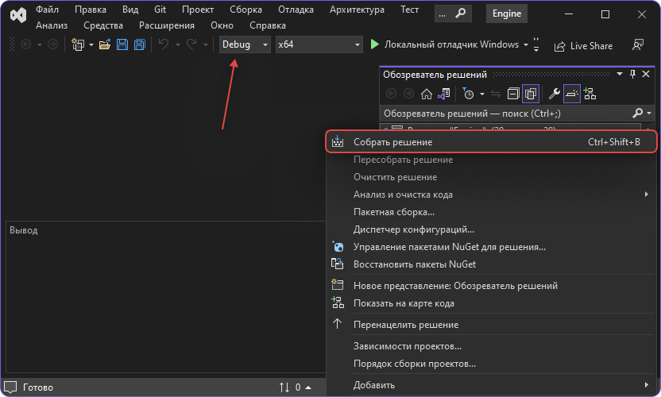

import { Callout } from 'nextra-theme-docs'

# Source Code Compilation
Currently, it is possible to build the project for the following platforms:
- Windows 10 20H2 64-bit and newer

In the future, it will be possible to build for all other platforms, including mobile devices.

<Callout type="info" emoji="ℹ️">
  Pay attention to the order. It is crucial to build X-Ray Engine first and then Unreal Engine!
</Callout>

## Cloning the Project
You need to do this recursively using the `--recursive` parameter

```bash
git clone https://github.com/RedPandaProjects/Stalker2UE --recursive
```



## Building X-Ray Engine
X-Ray is located at the following path:

```path
{src}/Source/XRayEngine/Source/Engine.sln
```

You need to open this project and compile it with the required [configuration](../install-and-build/configs).

---

### Build Example
Building `DebugGame Editor` in the Unreal project. To do this, I need to build all solutions with the `Debug` configuration.

<Callout type="warning" emoji="⚠️">
  Everything should be as described in [that](../install-and-build/configs) table; otherwise, it won't work!
</Callout>



## Building the UE Project

### 1. Creating a Visual Studio Project for UE Build
After successfully building X-Ray Engine, return to the repository's root folder and generate the project.


**Note**
* If you don't see the "Generate Visual Studio project files" options, you can fix it with [this video](https://www.youtube.com/watch?v=MZu5EB2UfiA).
* Before generating the project, to avoid compilation errors, keep only the latest version of MSVC in Visual Studio Installer.

---

### 2. Compiling Files to Launch the Unreal Engine Project
After generating the Visual Studio project, open it and select the desired build configuration.

The generated file can be found at `{src}/Stalker.sln`


**Note**
* After the build, you can run the editor, but you won't be able to play until you install the full content.
* You can find the current content build for the latest release in our [Discord](https://discord.gg/redprojects) channel [#last-build](https://discord.com/channels/530968529311367178/1085389969675268196).

---

### 3. Launching the Project
After a successful build, you can launch the editor either by clicking the `Launch` button in VS or through the `{src}/Stalker.uproject` file.
