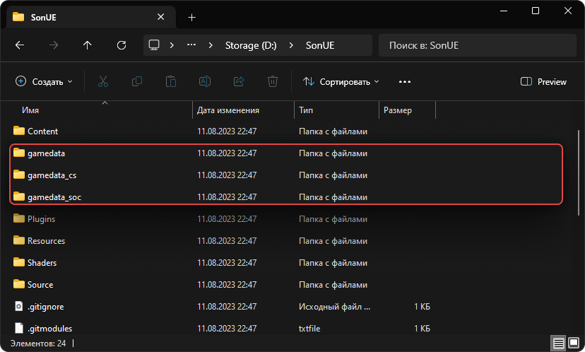
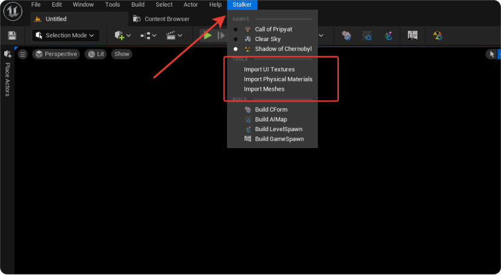

import { Callout } from 'nextra-theme-docs'

# Імпорт контенту з gamedata/rawdata
<Callout type="info" emoji="ℹ️">
  Актуальну збірку контенту ви можете знайти у нашому [дискорді](https://discord.gg/redprojects) в каналі [#last-build](https://discord.com/channels/530968529311367178/1085389969675268196).
</Callout>

## Підготовка ресурсів
Якщо ви вирішили імпортувати контент з **gamedata**, спочатку вам необхідно розмістити повну версію **gamedata** та **rawdata** в кореневу папку проекту.

### Таблиця

| Гра                                 | Назва gamedata | Назва rawdata |
|-------------------------------------|----------------|---------------|
| S.T.A.L.K.E.R.: Shadow of Chernobyl | gamedata_soc   | rawdata_soc   |
| S.T.A.L.K.E.R.: Clear Sky           | gamedata_cs    | rawdata_cs    |
| S.T.A.L.K.E.R.: Call of Pripyat     | gamedata       | rawdata       |

У таблиці показані назви папок, де потрібно розмістити ресурси залежно від обраної гри. Папка `rawdata` розташовується за шляхом `{src}/Source/XRayEngine`.

**Примітка**:
* Початково, папки gamedata для всіх трьох частин є в git'і, але вони містять лише скрипти та конфігурації. НЕ ВИДАЛЯЙТЕ ЇХ АБО НЕ ЗАМІНЮЙТЕ.
* У папці rawdata знаходяться вихідні файли контенту для X-Ray SDK. Вам потрібно перемістити папки `levels` та `objects` до цієї папки.
* В папці gamedata вам потрібно перемістити все інше.

## Імпорт в Unreal Engine

Після налаштування папок gamedata та rawdata, в редакторі необхідно зробити мінімальний імпорт необхідного контенту для запуску PIE (Play In Editor).

### Відкрийте меню "Stalker"

Послідовно виконайте три команди імпорту:
- Імпорт текстур інтерфейсу
- Імпорт фізичних матеріалів
- Імпорт мешів

Після цього ви можете створити тестову локацію та запустити PIE.

**Примітка**:
Проект дозволяє імпортувати наступні формати в UE5:
- `.dds` (стиснуті)
- `.ogf`
- `.object`
- `.level` (XRay SDK)
- `.gamemtl.xr`
