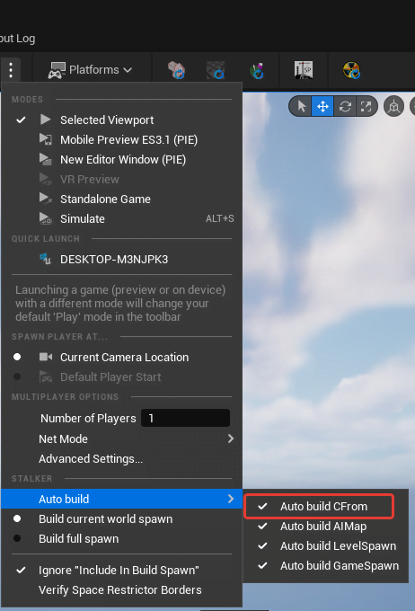
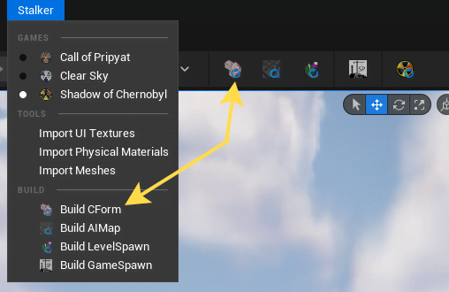

import { Callout } from 'nextra-theme-docs'

# Примітки щодо CForm

CForm - це геометрія, яка використовується для колізій та фізики в GSC.

<Callout type="info" emoji="ℹ️">
  На відміну від [AI Map](./ai-map) або [Spawn Objects](./spawn-objects), його не потрібно перевіряти на необхідність перебудови.
</Callout>

---

Можна налаштувати автоматичну перебудову перед початком PIE (Play In Editor).

Також його можна перебудувати вручну.

