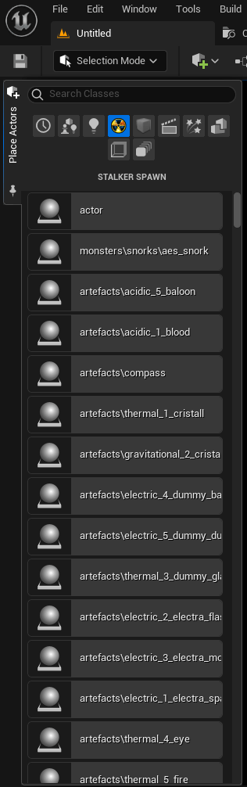
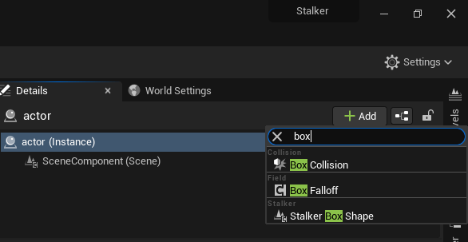
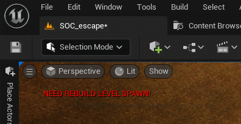
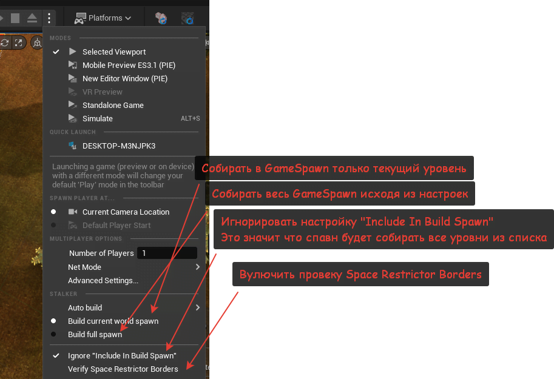
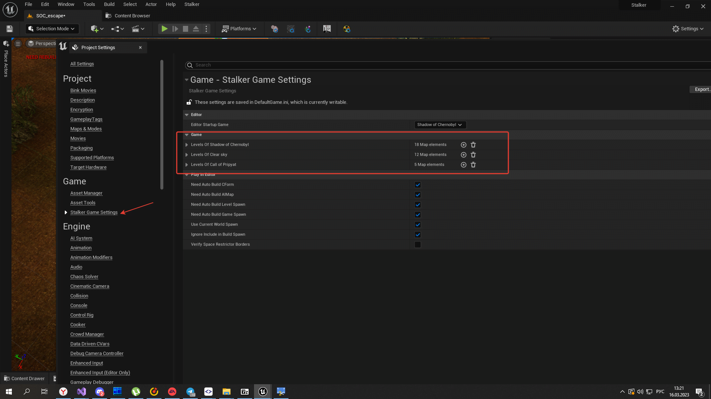
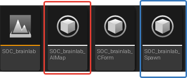
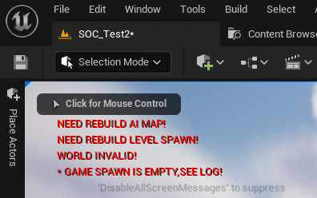

# Как работать с Spawn Object

## Создание Spawn Object

Создание и редактирование Spawn Objects схоже с оригинальным редактором GSC. В `Place Actors` создан отдельный список объектов, он заполняется автоматически как в оригинальном SDK GSC.

Они также работают через SE\_Factory.

Свойства почти идентичны GSC свойствам спавна Shape (Box, Sphere). Добавляются как компонент.

Пример заполнения Shapes SpawnObject.

Их отображение можно отключить.

## Сборка Spawn для игры

Также Unreal Editor автоматически помечает, что Level Spawn требует пересборку.

Сборка спавна как и у пыс делится на два типа:
1. LevelSpawn - Спавн уровня (Спавн уровня можно собрать только на самом уровне)
2. GameSpawn - Спавн всей игры (Собирается из спавнов уровней как настроите)

Она также может быть автоматической при необходимости для PIE (Play In Editor).

* * *

Для PIE есть режимы сборки GameSpawn

Настройка списка уровней которые используется для сборки GameSpawn находится в настройках проекта. Для каждой игры свой список

Тут настраивается ссылка на уровень также и `Include In Build Spawn`

При отключенном `Include In Build Spawn` и в PIE "Ignore `Include In Build Spawn`" уровень при автоматической сборке `Build full spawn` не будет включен в список

Также сборку можно вызвать в ручную

* * *

Сборка GameSpawn из бара или меню будет собирать весь GameSpawn целиком с игнорированием `Include In Build Spawn` (то есть все уровне которые есть в списке для данной игры)

Как выглядит лог сборки Level Spawn

Как выглядит лог сборки GameSpawn

Для корректной сборки GameSpawn нужно чтобы все пункты были выполнены:
1. Хотя бы один GraphPoint на каждом уровне
2. Только один "actor" он single\_player
3. Наличие у уровня собранного LevelSpawn,AIMap

Собранный файл выглядит как в оригинале:

При ошибке при сборке спавна, подробная информация указывается в логе

