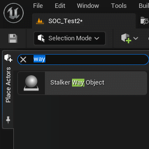
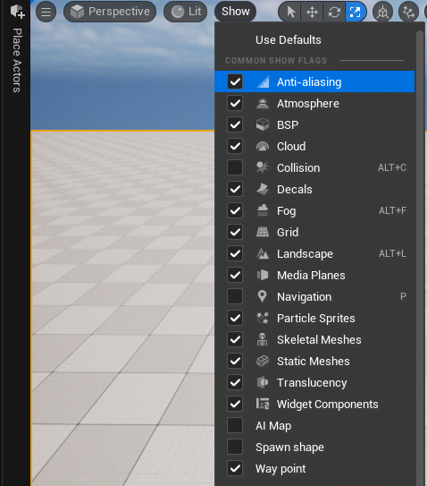

# Как работать с Way Object

## Way Objects
Для начало его нужно создать. Ищем в `Place Actors` Stalker Way Object.

Далее необходимо перейти в режим редактирования `Way Points Editor`.

### Описания режима редактирования
Он полностью аналогичен оригинальному редактору.

#### Пример работы

import { Youtube } from 'components/YouTube'

<Youtube code="uCJ2ObdGlq4" />

## Дополнительная информация

Way Object'ы являются частью спавна, следовательно, при их редактирование спавн устаревает и требует пересборку.
Она также может быть автоматической или ручной все как вы настроите.
Про то как работать со спавном прочтите [Как работать с Spawn Object'ами](./spawn-objects)

Рендер Way points можно включить и выключить в `show`

