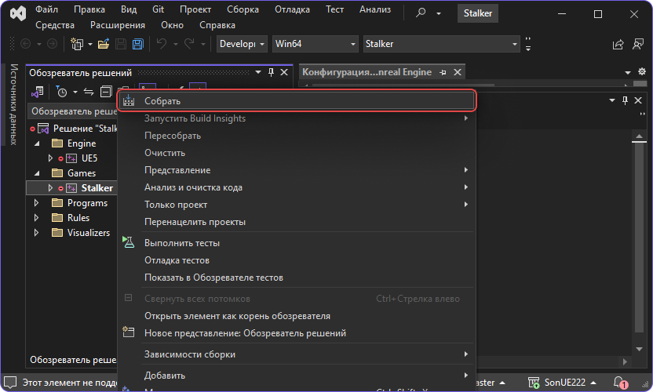

import { Callout } from 'nextra-theme-docs'

# Сборка исходного кода

На данный момент возможность собрать проект под следующие платформы:

- Windows 10 20H2 64-bit и новее

В будущем возможна сборка под все остальные пратформы, вплоть до мобильных устройств.

<Callout type="info" emoji="ℹ️">
  Обратите внимание на очередность. Очень важно собрать сначала X-Ray Engine, а потом только Unreal Engine!
</Callout>

## Клонируем проект

Необходимо сделать это рекурсивно используя параметр `--recursive`

```bash
git clone https://git.s2ue.org/RedProjects/SonUE --recursive
```


## Автоматическая сборка

### 1. Запуск скрипта сборки

Запустите `build.bat` и ждите успешного окончания сборки.

### 2. Запуск проекта

После успешной сборки редактор можно запустить через файл `{src}/Stalker.uproject`

## Ручная сборка

### 1. Сборка X-Ray Engine

X-Ray находится по данному пути:

```path
{src}/Source/XRayEngine/Source/EngineSOC.sln
```

Данный проект необходимо открыть и скомпилировать с нужной [конфигурацией](../install-and-build/configs).

#### Пример сборки

Сборка `DebugGame Editor` в проекте Unreal. Для этого мне нужно собрать все решения с конфигурацией `Debug`.

<Callout type="warning" emoji="⚠️">
  Все как в [той](../install-and-build/configs) таблице иначе не запустится!
</Callout>


### 2. Сборка UE проекта

#### 2.1. Создание VS проекта для сборки UE

После успешной сборки X-Ray Engine следует вернуться в корневую папку репозитория и сгенерировать проект.


**Примечание**

- Если нет пунктов "Generate Visual Studio project files", можно исправить по [этому видео](https://www.youtube.com/watch?v=MZu5EB2UfiA).
- Перед генерацией проекта, в избежании ошибок при компиляции, нужно оставить только последнюю версию MSVC в Visual Studio Installer

---

#### 2.2. Компиляция файлов для запуска проекта Unreal Engine

После генерации проекта Visual Studio необходимо открыть его и выбрать нужную конфигурацию сборки.

Сгенерированный файл находится по пути `{src}/Stalker.sln`.

**Внимание!!!** Выберите `Games / Stalker` в обозревателе проекта и нажмите "Собрать".



**Примечание**

- После сборки можно запускать редактор, но вы не сможете играть пока не поставите полный контент.
- Актуальную сборку контента для последнего билда вы можете найти в нашем [дискоде](https://discord.gg/red-projects-530968529311367178) в канале [#last-build](https://discord.com/channels/530968529311367178/1085389969675268196).

---

### 3. Запуск проекта

После успешной сборки редактор можно запустить либо кнопкой `Запуск` в VS, либо через файл `{src}/Stalker.uproject`
