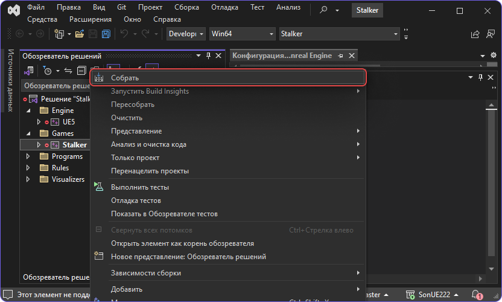

import { Callout } from 'nextra-theme-docs'

# Збірка вихідного коду

На даний момент можливість зібрати проект під наступні платформи:

- Windows 10 20H2 64-bit та новіші

У майбутньому можлива збірка під усі інші платформи, аж до мобільних пристроїв.

<Callout type="info" emoji="ℹ️">
  Зверніть увагу на послідовність. Дуже важливо спочатку зібрати X-Ray Engine, а потім тільки Unreal Engine!
</Callout>

## Клонуємо проект

Необхідно зробити це рекурсивно використовуючи параметр `--recursive`

```bash
git clone https://git.s2ue.org/RedProjects/SonUE --recursive
```


## Автоматична збірка

### 1. Запуск скрипта збірки

Запустіть `build.bat` і чекайте успішного завершення збірки.

### 2. Запуск проекту

Після успішної збірки редактор можна запустити через файл `{src}/Stalker.uproject`

## Ручна збірка

### 1. Збірка X-Ray Engine

X-Ray знаходиться за даною адресою:

```path
{src}/Source/XRayEngine/Source/EngineSOC.sln
```

Даний проект необхідно відкрити та скомпілювати з потрібною [конфігурацією](../install-and-build/configs).

#### Приклад збірки

Збірка `DebugGame Editor` у проекті Unreal. Для цього мені потрібно зібрати всі рішення з конфігурацією `Debug`.

<Callout type="warning" emoji="⚠️">
  Все як у [тій](../install-and-build/configs) таблиці інакше не запуститься!
</Callout>


### 2. Збірка UE проекту

#### 2.1. Створення VS проекту для збірки UE

Після успішної збірки X-Ray Engine слід повернутися в кореневу папку репозиторію та згенерувати проект.


**Примітка**

- Якщо немає пунктів "Generate Visual Studio project files", можна виправити за [цим відео](https://www.youtube.com/watch?v=MZu5EB2UfiA).
- Перед генерацією проекту, щоб уникнути помилок при компіляції, потрібно залишити тільки останню версію MSVC у Visual Studio Installer

---

#### 2.2. Компіляція файлів для запуску проекту Unreal Engine

Після генерації проекту Visual Studio необхідно відкрити його та вибрати потрібну конфігурацію збірки.

Сгенерований файл знаходиться за шляхом `{src}/Stalker.sln`.

**Увага!!!** Виберіть `Games / Stalker` у переглядачі проектів і натисніть "Зібрати".



**Примітка**

- Після збірки можна запускати редактор, але ви не зможете грати поки не встановите повний контент.
- Актуальну збірку контенту для останнього білду ви можете знайти в нашому [дискорді](https://discord.gg/red-projects-530968529311367178) у каналі [#last-build](https://discord.com/channels/530968529311367178/1085389969675268196).

---

### 3. Запуск проекту

Після успішної збірки редактор можна запустити або кнопкою `Запуск` у VS, або через файл `{src}/Stalker.uproject`
