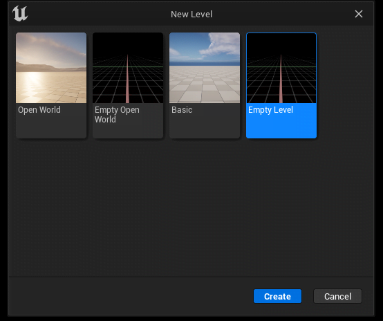

# Зміна гри в Unreal Engine

## Підготовка

Спочатку переконайтеся, що у вас не завантажений рівень з появою персонажа, оскільки це може спричинити збій. Також рекомендується створити порожній рівень.

## Зміна гри та перезавантаження XrGame
Виберіть потрібну гру та зачекайте, поки XrGame перезавантажиться.

**Примітка**
* Поява персонажа автоматично оновлюється після зміни гри.
