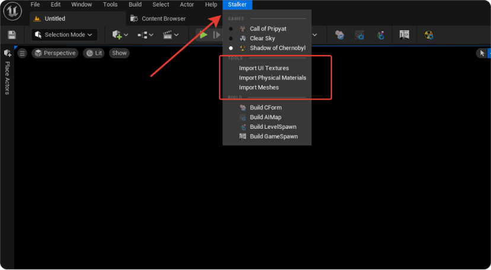

import { Callout } from 'nextra-theme-docs'

# Импорт контента из gamedata/rawdata
<Callout type="info" emoji="ℹ️">
  Актуальную сборку контента вы можете найти в нашем [дискоде](https://discord.gg/red-projects-530968529311367178) в канале [#last-build](https://discord.com/channels/530968529311367178/1085389969675268196)
</Callout>

## Подготовка ресурсов
Если вы решили импортировать контент из **gamedata**, то вам сначала необходимо поставить полную версию **gamedata** и **rawdata** в корневую папку проекта

### Таблица

| Игра                                | Название gamedata | Название rawdata |
|-------------------------------------|-------------------|------------------|
| S.T.A.L.K.E.R.: Shadow of Chernobyl | gamedata_soc      | rawdata_soc      |
| S.T.A.L.K.E.R.: Clear Sky           | gamedata_cs       | rawdata_cs       |
| S.T.A.L.K.E.R.: Call of Pripyat     | gamedata          | rawdata          |

Таблица с названием папок, куда следует поместить ресурсы в зависимости от нужной игры. Папка `rawdata` находится по пути `{src}/Source/XRayEngine`

**Примечание**:
* Изначально папки gamedata для всех трёх частей есть в git'е, но в них только скрипты и конфиги ИХ УДАЛЯТЬ ИЛИ ЗАМЕНЯТЬ НЕЛЬЗЯ
* В папке rawdata лежат исходники контента для X-Ray SDK. В них необходимо переместить папки `уровней` и `objects`
* В папке gamedata необходимо переместить всё остальное

## Импорт в Unreal Engine

После того как вы настроили папки gamedata и rawdata, в редакторе необходимо сделать минимальный импорт нужного контакта для запуска PIE(Play In Editor).

### Откройте меню "Stalker"

По очерёдности вызовете три команды импорта:
- Import UI Textures
- Import Physical Materials
- Import Meshes

После этого можно создать тестовую локацию и запустить PIE

**Примечание**:
Проект позволяет импортировать следующие форматы в UE5:
- `.dds` (с сжатием)
- `.ogf`
- `.object`
- `.level` (XRay SDK)
- `.gamemtl.xr`
