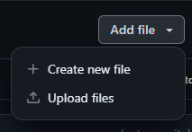
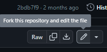
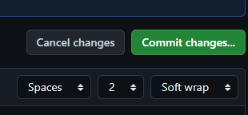

import { Steps } from 'nextra-theme-docs'

# Як додати або змінити інформацію

Для редагування документації створіть Issue або Pull Request на сторінці [GitHub](https://github.com/PSIget/SonUE-Docs)

## Створення Pull Request

<Steps>

### Виберіть або створіть необхідний файл для редагування

#### Створення або завантаження файлу

Виберіть потрібний пункт

---

#### Редагування файлу

Виберіть файл і натисніть на іконку з "олівцем"

### Створіть Fork

### Внесіть необхідні зміни і натисніть `Commit changes`

### Натисніть `Propose changes`

### Натисніть `Create pull request`

### Натисніть ще раз `Create pull request`

### Готово! Залишилося лише зачекати

</Steps>

Дякуємо за ваш внесок! Як тільки наші модератори звільняться, вони займуться розглядом ваших змін!
